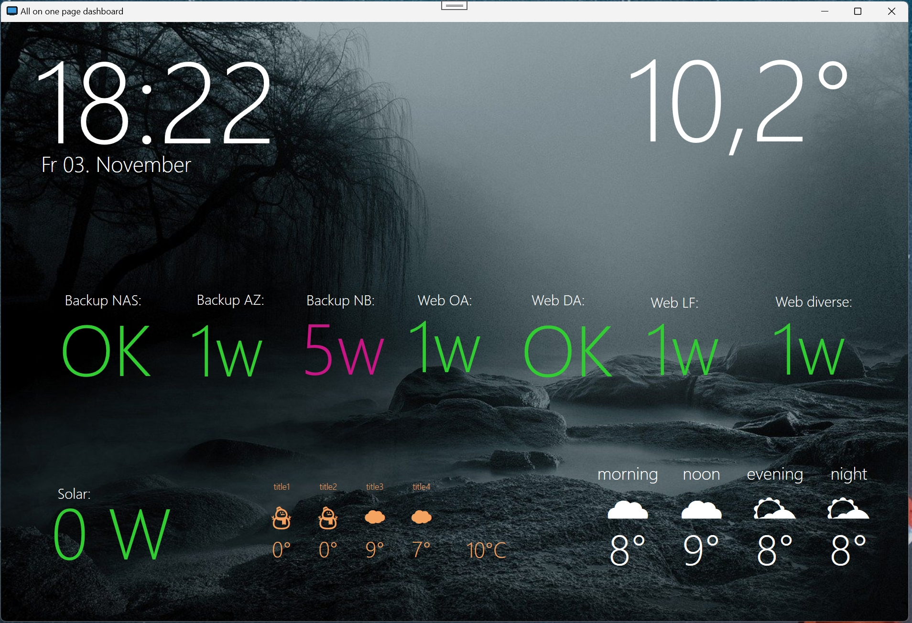
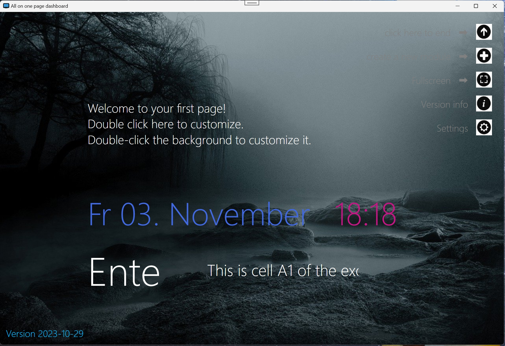
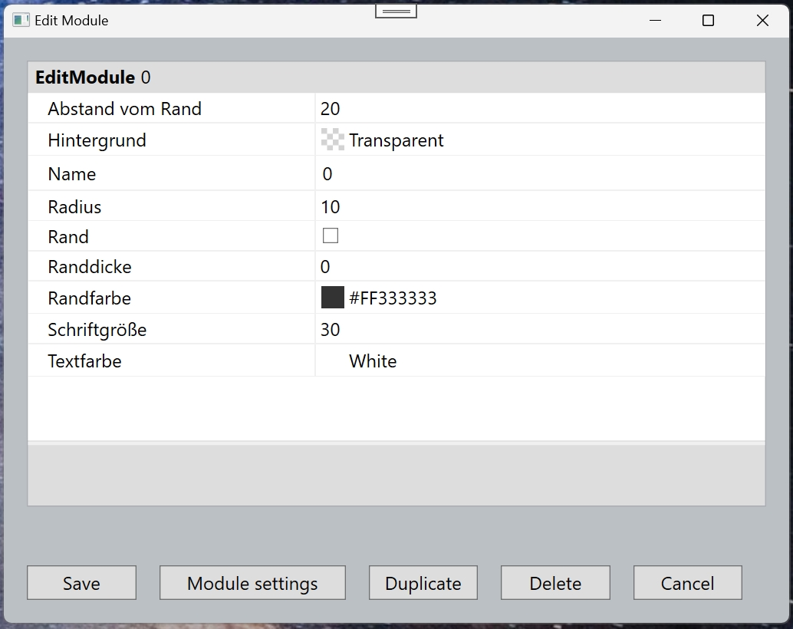
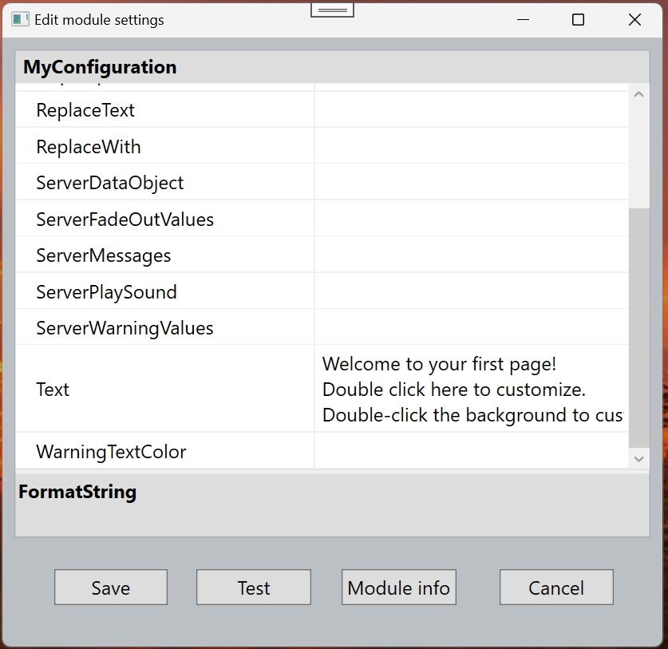
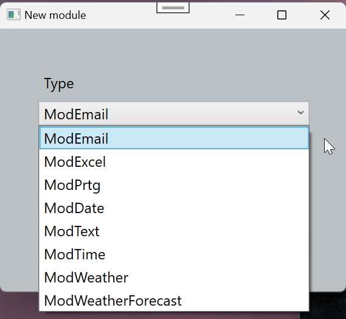
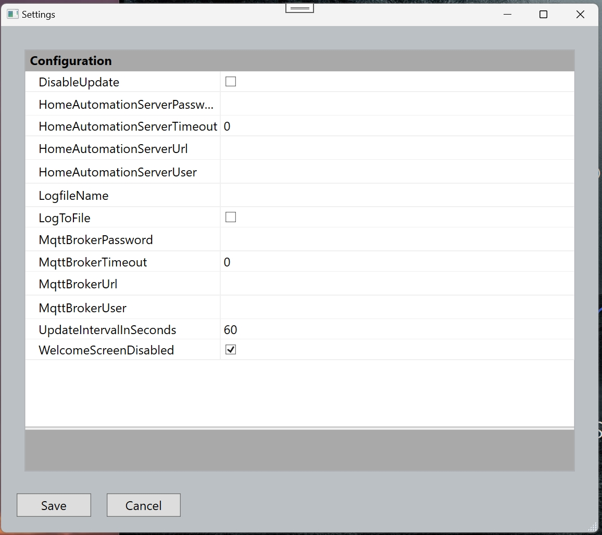
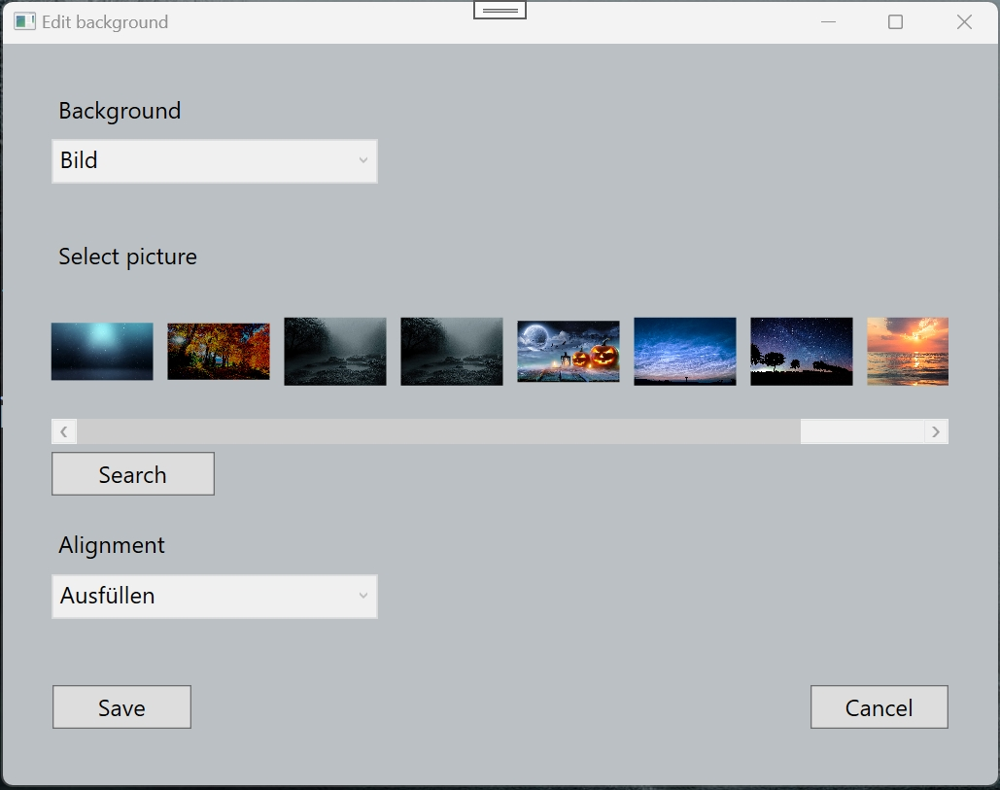
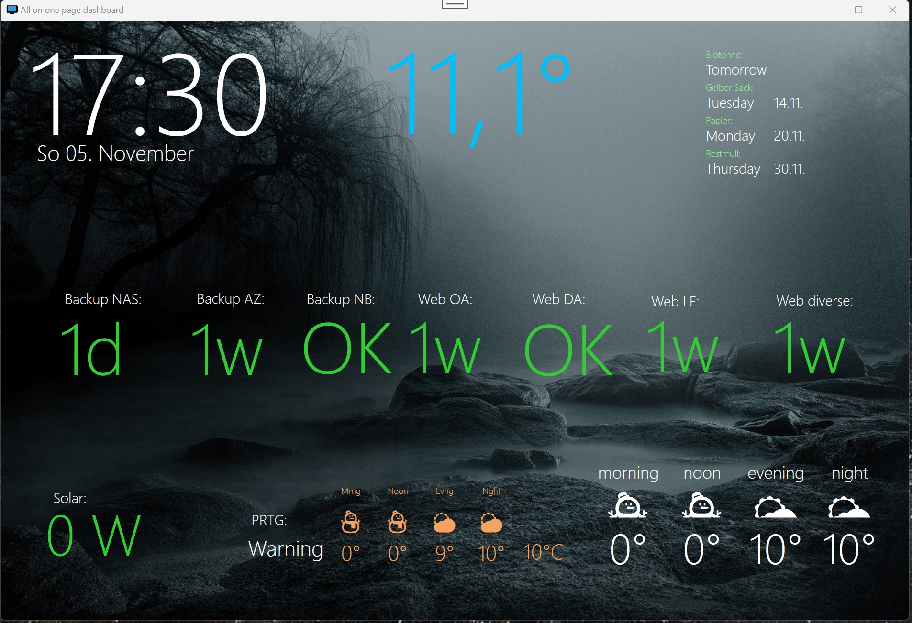

# Abraham.AllOnOnePage

    

## OVERVIEW

AllOnOnePage is a WPF Dashboard application that can display values from various sources:
MQTT brokers, PRTG server, Openweathermap.com, Email postboxes, Google calenders, Excel files, and FinTX bank accounts.

- It is meant to run as a fullscreen dashboard application on a dedicated PC or tablet.
- You can also run it as a windowed application on your desktop, having your important data on one page.
- Have the current weather, time and your bank account balance side by side. :-)
- You have an excel file with important data? Display individual cells on your dashboard!
- You can monitor your backups, using my tool "BackupServerDaemon"
- You can display appointments from your google calendar.

## LICENSE

Licensed under Apache licence.
https://www.apache.org/licenses/LICENSE-2.0

## Compatibility

The nuget package was build with DotNET 6.

## INSTALLATION

- download the latest release from my github repository (zip)
- or clone this repository and build it yourself.
- in the first start, it will create a demo page for you.

## INTEGRATION WITH HOME AUTOMATION SYSTEMS

If you want to use an MQTT broker, I recommend using Mosquitto. It's quite easy to install and configure.
You can find it here: https://mosquitto.org/
I'm using it inside Homeassistant. It can be installed as an add-on to homeassistant.
Homeassistant can be found here: https://www.home-assistant.io/

## AUTHOR

Oliver Abraham, mail@oliver-abraham.de, https://www.oliver-abraham.de

Please feel free to comment and suggest improvements!

## SOURCE CODE

The source code is hosted at:

https://github.com/OliverAbraham/AllOnOnePage

## SCREENSHOTS

This first screenshot shows the main window of the application. 
The middle row shows ages for several backups, loaded from my home automation server.
The bottom left shows the current solar production, loaded from my MQTT broker.
To the right Weather information from openweathermap.com.
(you can sign up and get an api key for free)

This shows the demo screen that is created on the first start of the application:

Several configuration dialogs:

# CURRENT MODULES
- ModText: can display simple static text or MQTT topics
- ModDate
- ModTime
- ModExcel: Can display a given cell from an excel file
- ModWeather: Display the current temperature for a given location 
- ModWeatherForecase: Display forecast for the next day 
- ModPrtg: Display PRTG topics
- ModGoogleCalendar: Display appointments from a google calendar. Searches for up to four
events by given search terms.
- ModGoogleCalendar2: Display next n appointments from a google calendar (subject, date and time, up to 4).
- a general calendar is planned.
- Email: displays the number of unread emails in a given postbox
- Notification Area: can display events. You can define a set of MQTT topics with values.
When a topic changes to a certain value, that value or a appropriate text is shown in the
notification area.
The notification will disappear after a defined time.
If more topics come in, newer data replaces older.
This can also play a small notification sound, like a bell. Some sounds a shipped with the app.
Or display the text in a separate color.
You can define rules, i.e. display negative values in red, values above a threshold in yellow. 
Play a sound when your cat comes throught the cat flap.

 
# PLANNED AND UNFINISHED MODULES
- REST call. Display the result of a REST GET call.
- LibFintx is a library to access bank accounts via FinTX. 					
It will display the current Balance of a given bank account.
Maybe the number of new transactions.

- 
# MAKE A DONATION !

If you find this application useful, buy me a coffee!
I would appreciate a small donation on https://www.buymeacoffee.com/oliverabraham

